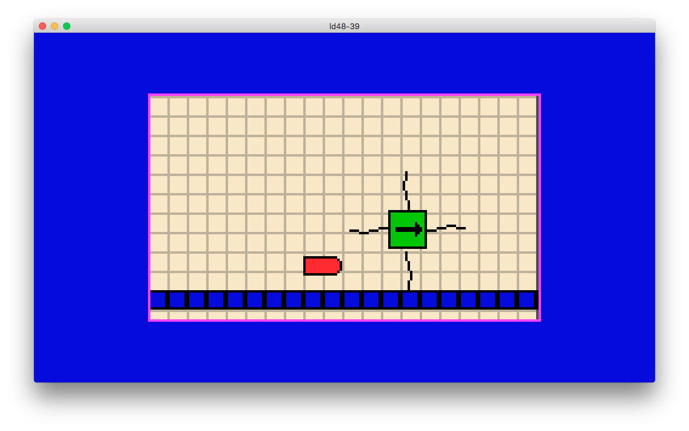

# ld48-39

My failed attempt for the Ludum Dare 48 hour Compo

##### Lessons learned:
* **Know your tools and pipeline.**
Experimenting with new stuff during a time-sensitive event like the LD is not ideal. Especially with documentation scarce software like Godot.
* **Get in the zone at soon as possible.**
Do all your chores before the jam, create a distraction-free environment, disable all your notifications, code like your life depends on it.
* **Lose the fat.**
Stuff like menus, particle effects and screen shake are nice but leave it for when you have your core gameplay loop and main art done.
